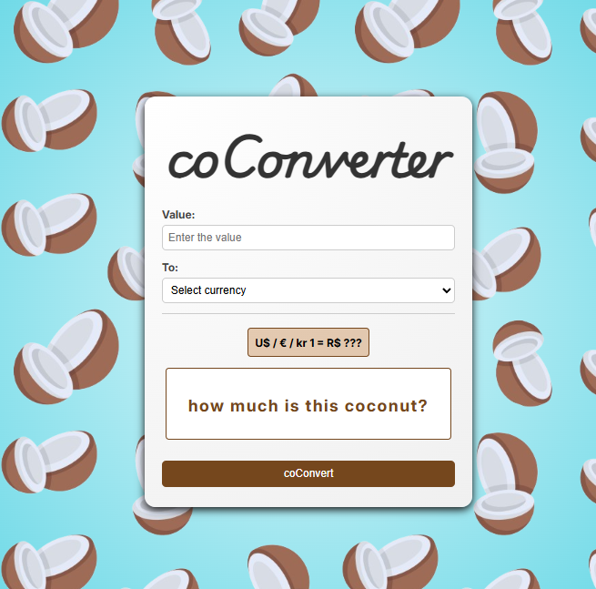
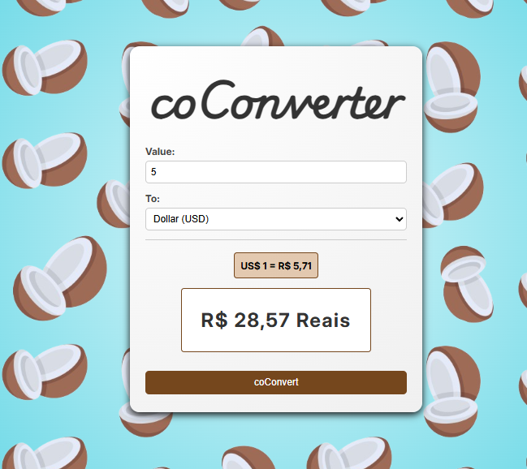

# 🥥 coConverter

**coConverter** is a simple currency converter developed with **HTML**, **CSS** and **pure JavaScript**, with the main objective of **practicing and consolidating knowledge** in these technologies, especially javascript.

The project allows you to convert a fixed amount in Brazilian Real (BRL) to one of the following currencies: **US Dollar (USD)**, **Euro (EUR)**, or **Norwegian Krone (NOK)**, using fixed exchange rates defined directly in the code.

 

---

## 🎯 Project Goal

This project was created for **educational purposes** as an exercise to practice:

- Structuring pages with **HTML**
- Styling with **CSS**
- DOM manipulation, event handling, and forms with **JavaScript**

---

## 🚀 Features

- ✅ Conversion from BRL to USD, EUR, or NOK
- ✅ Prevention of non-numeric characters in the input field
- ✅ Display of the conversion result and the applied exchange rate
- ✅ Fully functional offline (without external APIs)

---
## 🛠 Technologies

- HTML5
- CSS3
- JavaScript (Vanilla)

---

## 🔮 Future Improvements

- 🌐 **Integration with currency exchange APIs** for real-time rates
- 📱 **Responsiveness**, with design adjustments for mobile and tablet devices
- 🔄 **Conversion between any two currencies**, not just from BRL to foreign currencies

